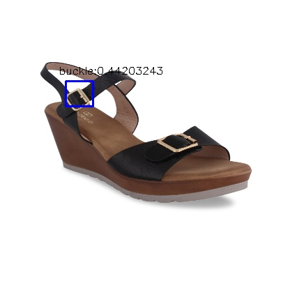
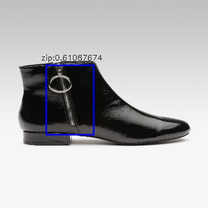

## YOLO Object Detection Model for TF Serving

Two Classes: Zip & Buckle

* Dataset size: 1018
Zip: 574
Buckle: 587

- [DarkFlow](https://github.com/thtrieu/darkflow)
- [Details](https://pjreddie.com/darknet/yolov2/)
- [Paper](https://arxiv.org/pdf/1612.08242.pdf)

#### Demo

### Future Scope:
    [x] Fix the issue for the prediction result
    [ ] Add a functionality for NMS
    [ ] Deploy (Docker)
    [ ] Add a user interface

run `predict.py` in the scripts directory to test the model with image arguments

